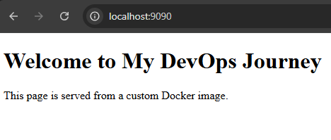

# 🚀 Lab 02 – Build Custom Docker Image with Nginx

## 🎯 Objective

To build a custom Docker image using Nginx that serves a personalized HTML page, understand Docker image layers, and deploy the container locally.

This lab focuses on:

* Writing a Dockerfile
* Building a custom Docker image
* Running a container from a custom image
* Understanding Docker image layers
* Versioning Docker images

---

## 🏗️ Architecture

```
Dockerfile
     ↓
Custom Docker Image (atul-nginx:v1)
     ↓
Docker Container
     ↓
Browser (http://localhost:9090)
```

---

## 📂 Project Structure

```
lab-02-custom-nginx/
│
├── Dockerfile
├── index.html
├── lab2_readme.md
├── commands.txt

```

---

## 📝 Step 1 – Create Custom HTML Page

File: `index.html`

```html
<!DOCTYPE html>
<html>
<head>
    <title>Atul DevOps Lab</title>
</head>
<body>
    <h1>Welcome to My DevOps Journey</h1>
    <p>This page is served from a custom Docker image.</p>
</body>
</html>
```

---

## 🐳 Step 2 – Create Dockerfile

File: `Dockerfile`

```dockerfile
FROM nginx:latest

COPY index.html /usr/share/nginx/html/index.html
```

### Explanation

* `FROM nginx:latest`
  Uses official Nginx base image.

* `COPY index.html /usr/share/nginx/html/index.html`
  Replaces the default Nginx page with custom HTML.

Each Dockerfile instruction creates a new image layer.

---

## 🔨 Step 3 – Build Docker Image

```bash
docker build -t atul-nginx:v1 .
```

### Explanation

* `-t` → tag the image
* `atul-nginx` → image name
* `v1` → version
* `.` → current directory (build context)

Verify image:

```bash
docker images
```

---

## 🚀 Step 4 – Run the Container

```bash
docker run -d -p 9090:80 --name custom-nginx atul-nginx:v1
```

### Explanation

* `-d` → detached mode
* `-p 9090:80` → maps host port 9090 to container port 80
* `--name custom-nginx` → container name

Access in browser:

```
http://localhost:9090
```

---

## 🛑 Step 5 – Stop & Remove Container

```bash
docker stop custom-nginx
docker rm custom-nginx
```

---

## 📸 Screenshots


## 🧠 Key Learnings

* Difference between Docker image and container
* Docker build process
* Docker image layering
* Port mapping concept
* Image versioning using tags
* Serving static content using Nginx

---

## 🔍 Production Relevance

In real-world environments:

* Nginx is used to serve frontend applications.
* Custom Docker images are built for application deployment.
* Versioning ensures controlled releases.
* Images are pushed to Docker Hub or private registries.
* Containers are deployed to Kubernetes or cloud platforms.

